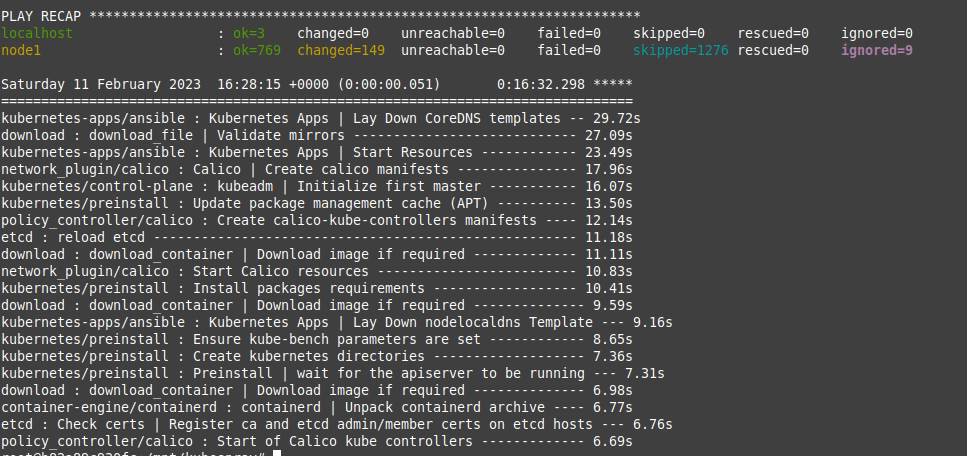
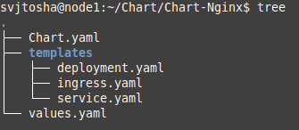
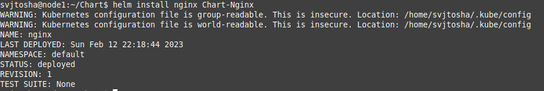
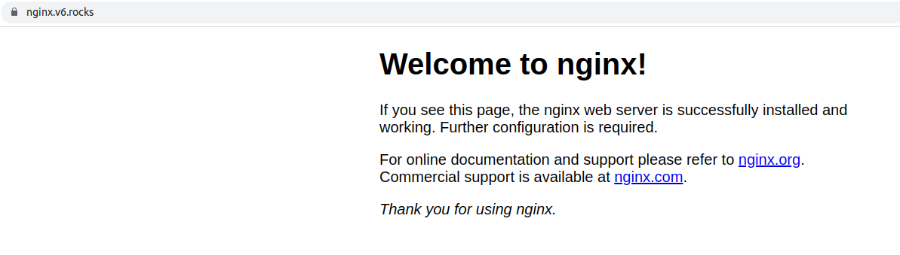
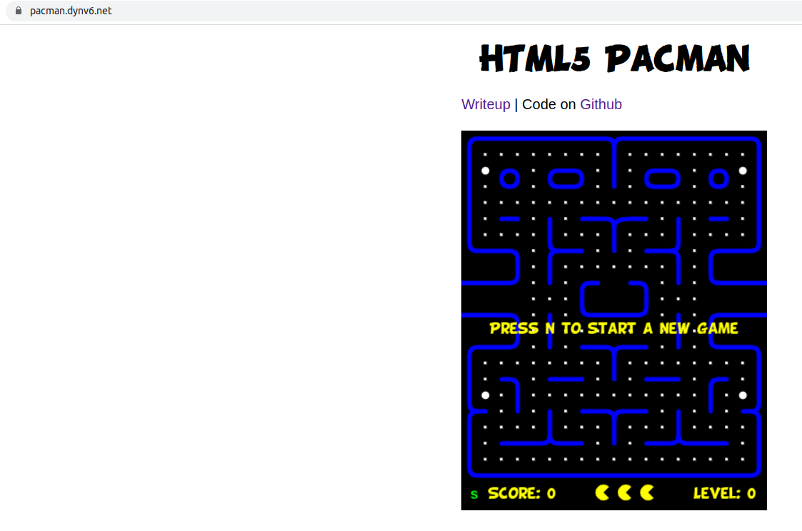

# Kubernetes Helm Home Task

1. I brought the machine up on GCP and configured:
   - Cloned Kubespray release repository;
   - Copied and edited inventory file;
   - Turned on MetalLB;
   - Ran execute container;
   - Started ansible-playbook;
   - Copied kubectl configuration file;
   - Installed Ingress-controller.

How to do it in more detail is indicated in the repository [Deploy K8s with help Kubespray and ansible playbook](https://github.com/bugaenkoyu/k8s-with-kubespray-and-ansible).

2. The next step was to install Helm in the Kubernetes cluster.

I did next steps for it:

~~~
wget https://get.helm.sh/helm-v3.11.1-linux-amd64.tar.gz
tar -zxvf helm-v3.11.1-linux-amd64.tar.gz
mv linux-amd64/helm /usr/local/bin/helm
helm version
helm list
rm -r helm-v3.7.2-linux-amd64.tar.gz linux-amd64
~~~

Then I created Helm Chart with folder templates which include next files: deployment, service and ingress and files Chart and values which are located in main.
The Helm Chart has the following hierarchy:

To install nginx I ran the following command:

~~~
helm install nginx Chart-Nginx
~~~

~~~
helm upgrade --atomic nginx Chart-Nginx/ --set replicaCount=6
~~~

~~~
helm upgrade -f myvalues.yaml nginx Chart-Nginx/
~~~

[https://nginx.v6.rocks/](https://nginx.v6.rocks/)

~~~
helm install pacman Chart-Pacman
~~~
[https://pacman.dynv6.net/](https://pacman.dynv6.net/)
