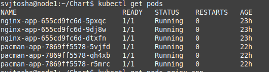
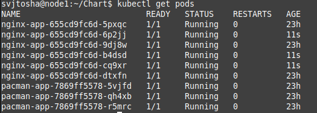
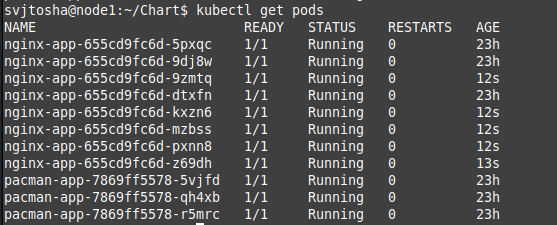
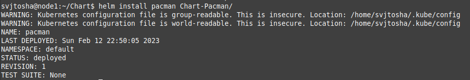

# Kubernetes Helm Home Task

1. I brought the machine up on GCP and configured:
   - Cloned Kubespray release repository;
   - Copied and edited inventory file;
   - Turned on MetalLB;
   - Ran execute container;
   - Started ansible-playbook;
   - Copied kubectl configuration file;
   - Installed Ingress-controller.

How to do it in more detail is indicated in the repository [Deploy K8s with help Kubespray and ansible playbook](https://github.com/bugaenkoyu/k8s-with-kubespray-and-ansible).

2. The next step was to install Helm in the Kubernetes cluster.

I did next steps for it:

~~~
wget https://get.helm.sh/helm-v3.11.1-linux-amd64.tar.gz
tar -zxvf helm-v3.11.1-linux-amd64.tar.gz
mv linux-amd64/helm /usr/local/bin/helm
helm version
helm list
rm -r helm-v3.7.2-linux-amd64.tar.gz linux-amd64
~~~

## Deploy Nginx

Then I created Helm Chart with folder templates which include next files: deployment, service and ingress and files Chart and values which are located in main.
The Helm Chart has the following hierarchy:

To install nginx I ran the following command:

~~~
helm install nginx Chart-Nginx
~~~

After installing nginx using the following command, we can see that 3 pods are now created for our deployment.

~~~
kubectl get pods
~~~

To change the values ​​in the running Helm Chart, we can use the following methods:
 - by specifying the value on the command line as shown below:

~~~
helm upgrade --atomic nginx Chart-Nginx/ --set replicaCount=6
~~~

 - By writing the variables to a yaml file and running as shown below:
~~~
helm upgrade -f myvalues.yaml nginx Chart-Nginx/
~~~

After installing nginx, I created a domain with a free registrar [dynv6.com](https://dynv6.com/) and also configured a Letsencrypt certificate using [cert-manager.io](https://cert-manager.io/)

And as a result, I got the page shown in the picture below.

## Deploy Pacman

As in the previous example, I created a Helm Chart.

To install, I used the following command:

~~~
helm install pacman Chart-Pacman
~~~

The result of the execution of the command is shown in the picture below.

For this application, a domain name was also created and a Letsencrypt certificate was configured.

The result is shown in the picture below.

